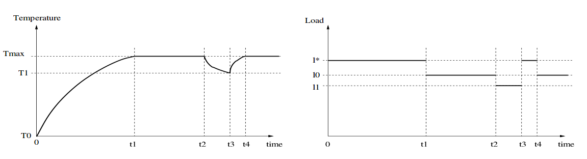
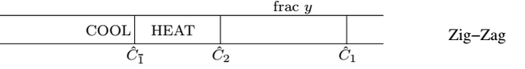
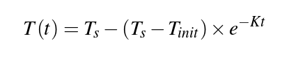
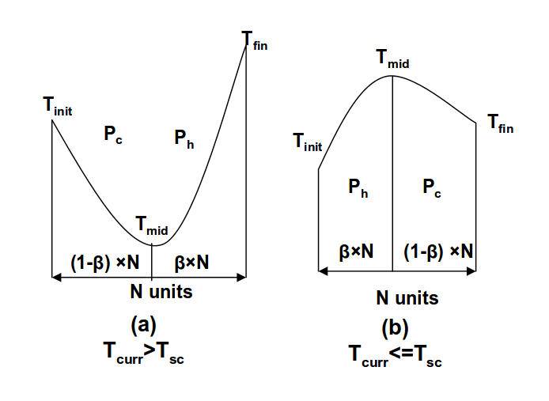

# Temperature Aware Scheduling

## Motivation

For computer systems, heat dissipation and system temperature are important factors to keep in mind when systems are in operation.  With the increased power density due to the fitting of more transistors onto computing hardware, systems are more susceptible to thermal scenarios which can be detrimental to their operation and reliability. For the modern PC, fans and heat sinks have been packaged with compute resources like CPUs to cool the system. Designing this packaging historically focused on worse-case operating temperatures.  However, because systems do not usually operate at this high-limit, the designed packaging can be excessive and unnecessarily costly [BM01].  If hardware and software could adjust its operation dynamically to manage system temperature, we could control the system so that these high thermal cases do not happen. Thus, one benefit of dynamic thermal management is that packaging engineers could focus on average rather than worst case thermal scenarios, reducing the excess of packaging.

For embedded systems where size or mobility is a constraint, like hand-held computing devices (i.e. smartphones), normal packaging solutions such as fans and heat sinks are not possible [JM09]. Yet, the same type of reliability concerns for computing hardware are present. The need for a dynamic temperature management in embedded systems, as one can see, is similarly pressing.

## Response Mechanisms for Dynamic Temperature Management

Response Mechanisms of dynamic temperature management are the means by which computing resources will reduce their power consumption for the means of reducing power dissipation. These can happen at a hardware and software level.  While we cover both the global or system throttling and other microarchitectural techniques, the remaining analysis of scheduilng algorithms makes use of system level throttling.

### System-level Throttling

Dynamic Frequency or Voltage Scaling.  Frequency scaling means to adjust the clock frequency of the entire system. Voltage scaling is to adjust the supply voltage to the computer system.  These are system level operations.

* Power ~ Clock Frequency
* Power ~ (Supply Voltage)^2

Delay in triggering these system-responses (system-throttling) are higher than with microarchitectural techniques that are more localized.

### Microarchitectural Techniques

* Decode throttling: relies on clock gating to reduce the flow of instructions to the CPU [BM01].  Effectively, the CPU is running idle on more cycles, so this is how power dissipation is reduced.
* Speculation Control: restrict the amount of speculation in a CPU pipeline [BM01].  Speculation in pipelining, in its most basic form, is to perform instructions that may not necessarily be needed.  The idea is that if resources are available in the pipeline, we can do more concurrent work in case that work is needed later on [W16].  Again, by reducing the speculation, we are letting resources be idle, which reduces power dissipation.
* I-cache Toggling: "disable the instruction fetch unit (instruction cache and branch prediction) and using the instruction fetch queue to feed the pipeline" [BM01].

## Scheduling Theory for Dynamic Temperature Management in Single Processor Systems

There is a wide landscape of approaches for temperature aware scheduling.

While Multiprocessors are very relevant to today's world, they bring a host of issues such as co-location and co-heating of cores physically close to each other. which are not in the scope of this article.

Still, the single processor case still has a large landscape of approaches.  They can be categorized into Dynamic vs Static, and Reactive vs Predictive.

### Dynamic versus Static

Like other scheduling theory, temperature aware scheduling also has techniques that perform scheduling on metrics that change dynamically, versus metrics that are unchanging throughout the execution.

The general rule is that dynamic scheduling algorithms in this domain change their scheduling depending on the operating temperature. For a single task scenario, dynamic can be realized via system throttling for a one task problem, where scheduling does not have the normal meaning of ordering of tasks, but instead how much compute resources the task gets per time unit [BM01].  For multitasking architectures, dynamic scheduling can also be realized by prioritizing the operation of "cold" versus "hot" tasks, where the operation of a "cold" task would lead to system cooling, and vice versa [JM09].

Static or design-time scheduling occurs before the execution of the task.  One example is the static analysis of code at compile time, to determine which blocks of code will be "high-power" and trigger a system throttle response during the execution inside the code block [BM01].

### Reactive versus Predictive

Reactive schedulers will throttle the load once a high-temperature scenario occurs.  The throttling occurs in response to a threshold temperature being exceeded, but has no awareness of what caused the scenario.  System throttling, realized through a constant load policy, is one example of a reactive scheduler [RY07].

On the other hand, a predictive scheduler will have a model of how much temperature will change based on running a current task.  The Temperature Aware Scheduler (TAS) proposed by [JM09] is a predictive scheduler.  It can predict that running a task at a particular load will exceed the temperature threshold, and thus will adjust in order to avoid the situation.  Predictive schedulers have the advantage of being aware of what causes high-thermal scenarios.

## Scheduling Algorithms

### System Throttling or Constant Policy

    Dynamic, Reactive, Single/MultiTask

The primary goal of temperature-aware scheduling is to keep the system temperature below a maximum temperature threshold,

$T_{max}$.

Let's consider the common system throttling strategy, outlined by [RY07]:

1. If the temperature reaches $$T_{max}$$, the system will enforce throttling, changing the load to $l_0$, the maximum load at which the system never reaches the maximum temperature.

2. If the temperature is below $T_{max}$ sufficiently long, we set the load to $$1 > l_* > l_0$$ where $l_*$ is the load at which the system keeps the temperature at $T_{max}$.

Two plots of temperature and load are shown, for the system throttling policy

Figure 1: System Throttling [RY07]

System throttling is proved to be optimal for single-processor systems when the goal is to maximize the amount of work done, and this work is assumed to be a single task [RY07].  The assumptions of this optimality is as follows

* the system is never idle, and always has work to do.  If this is not the case, we can imagine policies which allow cooling during times of inactivity, and maximum load when jobs are available, effectively increasing the load given to ready jobs.
* the system has a continuous range of operating speeds, so that it can operate at load $l_*$.

### Zig Zag Policy

    Dynamic, Reactive, SingleMultiTask

An optimal zig zag policy can be found to be better than the constant policy if any of the assumptions are broken. For example, often it is not practical to have a system that can operate at a discrete set of speeds; thus, we are forced to use a zig zag policy to operate in both regions of cooling and heating.

In addition, situations can arise where the processor can be left idle.  If this is the case, cooling when idle and operating at a speed higher than what the constant policy speed would look like would increase throughput.

Figure 2: Comparing Constant versus Zig Zag policies, in the case of where process C1 is pre-empted by C2.

Consider the case in Figure 2.  The arrival diagram on bottom highlights a case where, if the arrival time

$$\hat C_{\bar{1}} < C_{\bar{1}}$$

we, have less time for task 1 before task 2 preempts.  Implementing the zig zag policy, we can enter a stage of cooling before task 1 starts (lower speed), and then enter a heating phase as task 1 is operating. We can then achieve the same amount of work in less time, before task 2 preempts.

### Temperature Aware Scheduler (TAS) for Embedded Systems

    Dynamic, Predictive, MultiTask

The TAS discussed in [JM09] details an implementation for embedded architectures, such as smartphones, which have soft real-time tasks (like audio or video decoding), and best-effort tasks that do not have real-time constraints, such as a word processor.  This is a mult-level scheduling algorithm, since it has two parts of schedulers for these two types of tasks.  I think it's worthwhile to discuss this algorithm because

1. highlights a temperature predictive algorithm
2. shows priority scheduling based on whether a task would heat or cool the system.

#### 1. Temperature Prediction Model

The temperature model is a first-order system, explained by the equation

This algorithm depends on a model of temperature, aka a temperature profile, for any task that is run on the system.  To do this, one can collect data for temperature profiles when a task is run.  Knowing the initial temperature $T_{init}$, the steady state temperature $T_s$, and the constant $K$ which defines the exponential specific to the processor, we can model what the temperature will be at time unit $T(t)$ for the task at hand.

#### 2. Priority based on Hot vs Cold Tasks

Using this temperature model, we predict the temperature profiles of running a set of hot and cold tasks, where a hot task is one that will increase the system temperature, while a cold task will cool the system down.

Figure 3: Temperature profiles if the current temperature is less than the steady state temperature for the cold task.

Figure 3 illustrates the strategy for keeping the system cool.  In case 1, where the current temperature is greater than the cold task's steady-state temperature, we enter a phase of cooling, followed by a phase of heating.  To decide how much time $\beta N$ we allocated to the hot task, we can use our temperature model, and ensure that the final temperature does not exceed $T_{req}$ which is defined as the temperature required so that the system does not over heat in the next cycle.

In the second case, we can afford to run the hot task first; the two constraints is that

$$T_{mid} < T_{max}, T_{fin} < T_{req}$$

References

[BM01] D. Brooks and M. Martonosi, "Dynamic thermal management for high-performance microprocessors," High-Performance Computer Architecture, 2001. HPCA. The Seventh International Symposium on, Monterrey, 2001, pp. 171-182.

[JM09] R. Jayaseelan and T. Mitra, "Temperature Aware Scheduling for Embedded Processors," 2009 22nd International Conference on VLSI Design, New Delhi, 2009, pp. 541-546.

[RY07] Deepak Rajan and Philip S. Yu. 2007. On temperature-aware scheduling for single-processor systems. In Proceedings of the 14th international conference on High performance computing(HiPC'07), Srinivas Aluru, Manish Parashar, Ramamurthy Badrinath, and Viktor K. Prasanna (Eds.). Springer-Verlag, Berlin, Heidelberg, 342-355.

[W16] "Speculative Execution," Wikipedia 2016 https://en.wikipedia.org/wiki/Speculative_execution
